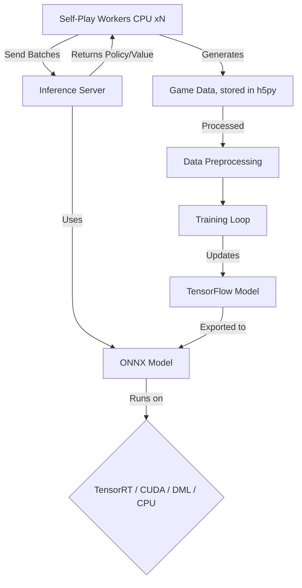

## AlphaZero General Implementation & Enhancements
A from scratch, high performance, implementation of DeepMind's Alpha Zero system in Tensorflow, featuring significant architectural and algorithmic improvements for efficiency, scalability, and performance. This project has been a long time dream of mine to complete.

To Henry, thanks for suggesting Alpha Zero to me in grade 10, I would never have come this far. Thank you for showing me my passion and my dream in life. Programming and ML has been the greatest passion I could have ever asked for. It has been a while but I'm nearing completion, I hope this shows you how far I've come from where I started. Again, thank you for showing me my path.

## 🚀 Key Features & Enhancements
This implementation includes the core AlphaZero algorithm but is significantly enhanced for performance and learning efficiency:

## 🎯 Core Implementation
General Game Framework: Framework capable of learning multiple perfect information games from scratch through self-play.

Monte Carlo Tree Search (MCTS): The core planning algorithm implemented as an implicit tree with memory efficiency in mind.

Residual Networks (ResNet): Standard deep neural network architecture for stable learning of complex value and policy functions.

## ⚡ Performance & Scalability
High-Performance Inference Server: A custom inference server that batches policy/value network requests from multiple MCTS workers. This is drastically more efficient than spawning multiple ONNX runtime instances, minimizing GPU overhead and maximizing throughput.

Multi-worker Self-Play: Parallel self-play data generation utilizing multiple CPU cores, significantly accelerating training.

Multi-Platform GPU Acceleration: Model exported to ONNX format for fast inference across multiple execution providers:

TensorRT (NVIDIA GPU - Fastest)

CUDA (NVIDIA GPU - Standard)

DirectML (AMD/Intel iGPU - Windows)

CPU (Fallback)

## 🧠 Advanced Algorithms & Stabilization
Implicit MCTS: A memory-optimized MCTS where parent nodes store children's statistics, reducing memory complexity and allowing for faster searches.

MuZero's PUCT Algorithm: An enhanced exploration formula that improves upon the original AlphaZero PUCT for better action selection.

Enhanced Value Training Target: Uses (Z(result) + Q(MCTS value)) / 2 as the training target for the value network. This hybrid target, combining the final game outcome with the MCTS-estimated value, leads to more stable and robust training compared to relying on a pure Z target.

Grokking Techniques: Integrated modern regularization techniques to improve generalization and combat overfitting:

GrokFast: A specific optimizer configuration for fast generalization.

OrthoGrad: Orthogonal gradients for fast generalization.

StableMax: A stabilized version of the softmax function to combat softmax collapse.

## 🕹️ Implemented Games

|Game |	Status | Description |
| --- | --- | --- |
|Tic-Tac-Toe |	✅ | Complete	Simple validation environment |
|Connect4	| ✅ | Complete	Classic 6x7 board game |
|Gomoku	| ✅ | Complete	5-in-a-row on a 15x15 board |
|Ultimate Tic-Tac-Toe |	🔄 | In Progress	Complex, strategic variant |
|Chopsticks	| 🔄 | In Progress	Simple perfect-information game |

# 🏗️ Project Architecture

Alpha Zero paper: https://arxiv.org/pdf/1712.01815

Mu Zero paper: https://arxiv.org/pdf/1911.08265

Gumbel Alpha Zero and Mu Zero: https://openreview.net/forum?id=bERaNdoegnO

Residual Network from: https://www.researchgate.net/publication/352720536_Efficiently_Mastering_the_Game_of_NoGo_with_Deep_Reinforcement_Learning_Supported_by_Domain_Knowledge

Monte Carlo Graph Search: https://arxiv.org/pdf/2012.11045

Grok Fast paper: https://arxiv.org/abs/2405.20233

Grokking at the edge of numerical stability: https://arxiv.org/pdf/2501.04697

RWKV-v4 paper: https://arxiv.org/abs/2305.13048

RWKV-v5,6: https://arxiv.org/abs/2404.05892

Should heavily consider:
Alpha Zero continous action space: https://arxiv.org/abs/1805.09613

Possible Reads: 

Accelerating MCTS: https://arxiv.org/abs/2310.06513
